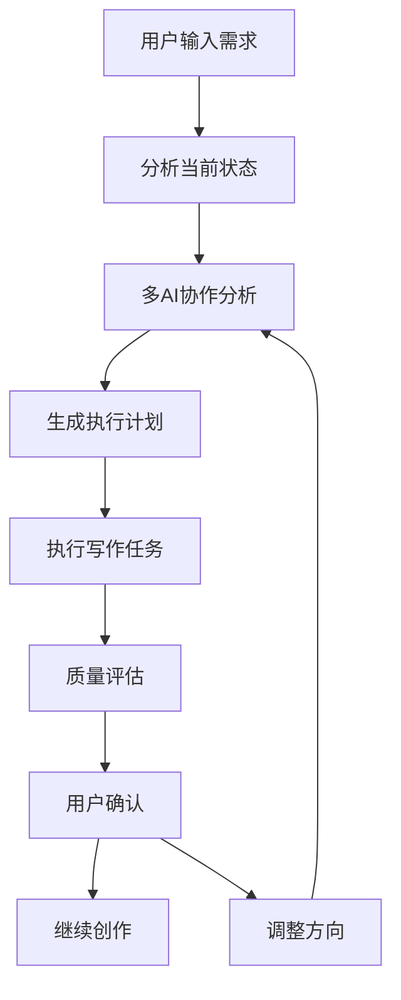

# 🤖 AI智能小说创作系统 - 完整技术规范

## 📋 项目概述

### 核心理念
基于多AI协作的半自动长篇小说创作系统，实现用户主导方向，AI负责执行和提供灵感的创作模式。

### 系统特点
- ✅ **多AI角色协作** - 进度分析师、伏笔管理专家、剧情规划师、质量评审师
- ✅ **智能任务分解** - 将复杂的小说创作分解为可管理的任务
- ✅ **知识库集成** - 写作技巧、风格参考、优秀作品分析
- ✅ **实时质量评估** - 站在编辑角度分析作品质量
- ✅ **工作流自动化** - AI自动规划、用户确认、智能执行

## 🏗️ 系统架构

### 后端服务架构

```
Backend Services:
├── AIWorkflowService        # 核心AI工作流服务
├── AIWritingService         # 基础AI写作服务  
├── PromptService           # 提示词管理服务
├── KnowledgeService        # 知识库服务
├── NovelService            # 小说管理服务
├── ChapterService          # 章节管理服务
└── QualityAnalysisService  # 质量分析服务
```

### 前端组件架构

```
Frontend Components:
├── IntelligentNovelWriter   # 智能写作主界面
├── SmartWriter             # 简化版写作界面
├── AIWorkflowPanel         # AI工作流控制面板
├── KnowledgeBrowser        # 知识库浏览器
├── QualityDashboard        # 质量分析面板
└── PromptLibrary           # 提示词库管理
```

## 🤖 AI角色设计

### 1. 进度分析师 (PROGRESS_ANALYST)
**职责：**
- 分析当前创作进度和阶段
- 管理伏笔埋设和回收时机
- 评估故事发展节奏
- 建议下一步创作重点

**核心功能：**
```java
public Map<String, Object> progressAnalysis(Novel novel, Map<String, Object> currentState) {
    // 分析创作阶段（开篇/发展/高潮/结局）
    // 识别伏笔埋设时机
    // 评估情节节奏
    // 生成进度报告
}
```

### 2. 伏笔管理专家 (PLOT_MANAGER)
**职责：**
- 识别和管理已埋设的伏笔
- 规划新伏笔的埋设时机
- 提醒伏笔回收时机
- 确保伏笔与主线的关联性

**核心功能：**
```java
public Map<String, Object> plotManagement(Novel novel, Map<String, Object> currentState) {
    // 识别已埋设伏笔列表
    // 评估伏笔重要程度
    // 建议伏笔回收时机
    // 新伏笔埋设建议
}
```

### 3. 剧情规划师 (STORY_PLANNER)
**职责：**
- 规划关键剧情节点
- 设计高潮情节和转折点
- 控制故事节奏和张力
- 提供爽点设计建议

**核心功能：**
```java
public Map<String, Object> storyPlanning(Novel novel, Map<String, Object> currentState) {
    // 规划关键剧情节点
    // 设计高潮情节
    // 安排转折点
    // 控制情节张力
}
```

### 4. 质量评审师 (QUALITY_REVIEWER)
**职责：**
- 站在编辑角度评估质量
- 分析读者吸引力
- 提供具体修改建议
- 评估商业化潜力

**核心功能：**
```java
public Map<String, Object> qualityReview(Novel novel, Map<String, Object> currentState) {
    // 开篇吸引力评分
    // 人物设定合理性
    // 情节推进节奏
    // 类型特色分析
}
```

## 🔄 智能工作流

### 核心工作流程



### AI协作决策机制

1. **并行分析** - 多个AI同时分析不同维度
2. **结果聚合** - 整合各AI的分析结果
3. **冲突解决** - 当AI意见不一致时的仲裁机制
4. **用户干预** - 用户可随时调整AI决策

## 📚 知识库系统

### 知识分类

1. **写作技巧库**
   - 开篇技巧
   - 对话写作
   - 环境描写
   - 情节转折

2. **类型风格库**
   - 都市异能
   - 穿越重生
   - 修仙玄幻
   - 科幻未来

3. **优秀作品分析**
   - 经典桥段
   - 成功人物设定
   - 精彩对话
   - 爽点设计

4. **读者偏好数据**
   - 热门题材
   - 流行元素
   - 读者反馈
   - 市场趋势

### 知识库调用机制

```typescript
interface KnowledgeQuery {
  taskType: string          // 任务类型
  novelGenre: string        // 小说类型
  currentContext: string    // 当前上下文
  specificQuery: string     // 具体查询
}

async queryKnowledgeBase(query: KnowledgeQuery): Promise<KnowledgeResult[]>
```

## 🎯 提示词工程

### 提示词分类管理

1. **角色专用提示词**
   - 进度分析师提示词
   - 伏笔管理专家提示词
   - 剧情规划师提示词
   - 质量评审师提示词

2. **任务专用提示词**
   - 内容生成提示词
   - 质量分析提示词
   - 风格模仿提示词
   - 情节规划提示词

3. **类型专用提示词**
   - 都市异能写作提示词
   - 玄幻修仙写作提示词
   - 现代言情写作提示词
   - 历史穿越写作提示词

### 动态提示词优化

```java
public class PromptOptimizer {
    // 基于效果自动优化提示词
    public String optimizePrompt(String originalPrompt, double effectiveness) {
        if (effectiveness < 0.7) {
            return enhancePrompt(originalPrompt);
        }
        return originalPrompt;
    }
    
    // 根据用户反馈调整提示词
    public void adjustPromptBasedOnFeedback(String promptId, String feedback) {
        // 分析反馈并调整提示词
    }
}
```

## 💻 技术实现

### 后端核心服务

```java
@Service
public class AIWorkflowService {
    
    // 启动智能写作工作流
    public Map<String, Object> startIntelligentWritingWorkflow(Novel novel, String userInput) {
        // 1. 分析当前状态
        Map<String, Object> currentState = analyzeCurrentState(novel, userInput);
        
        // 2. 多AI协作分析
        Map<String, Object> aiAnalysis = performMultiAIAnalysis(novel, currentState);
        
        // 3. 生成执行计划
        List<Map<String, Object>> actionPlan = generateActionPlan(aiAnalysis, userInput);
        
        // 4. 执行写作任务
        Map<String, Object> executionResult = executeWritingTasks(novel, actionPlan);
        
        return buildResult(currentState, aiAnalysis, actionPlan, executionResult);
    }
    
    // 多AI协作分析
    private Map<String, Object> performMultiAIAnalysis(Novel novel, Map<String, Object> currentState) {
        List<CompletableFuture<Map<String, Object>>> futures = Arrays.asList(
            CompletableFuture.supplyAsync(() -> progressAnalysis(novel, currentState)),
            CompletableFuture.supplyAsync(() -> plotManagement(novel, currentState)),
            CompletableFuture.supplyAsync(() -> storyPlanning(novel, currentState)),
            CompletableFuture.supplyAsync(() -> qualityReview(novel, currentState))
        );
        
        // 等待所有AI分析完成并聚合结果
        return aggregateAnalysisResults(futures);
    }
}
```

### 前端智能写作界面

```typescript
const IntelligentNovelWriter: React.FC = () => {
  const [aiAgents, setAiAgents] = useState<AIAgent[]>([
    {
      id: 'progress',
      name: '进度分析师',
      role: 'PROGRESS_ANALYST',
      description: '分析创作进度，管理伏笔时机',
      status: 'ready'
    },
    // ... 其他AI代理
  ])
  
  // 启动AI工作流
  const startAIWorkflow = async () => {
    setAiAgents(prev => prev.map(agent => ({ ...agent, status: 'working' })))
    
    try {
      // 调用后端AI工作流服务
      const workflowResult = await aiWorkflowService.startIntelligentWriting(novelId, userInput)
      
      // 执行多AI协作分析
      const analysisResult = await aiWorkflowService.performMultiAIAnalysis(novelId)
      
      // 更新UI状态
      setMultiAIAnalysis(analysisResult)
      setAiAgents(prev => prev.map(agent => ({ ...agent, status: 'ready' })))
      
    } catch (error) {
      handleError(error)
    }
  }
  
  return (
    <Layout>
      <Sider width={300}>
        {/* AI协作团队面板 */}
        <AIAgentPanel agents={aiAgents} onQueryAgent={querySpecificAgent} />
      </Sider>
      
      <Content>
        {/* 智能写作控制台 */}
        <WritingConsole onStartWorkflow={startAIWorkflow} />
        
        {/* AI分析结果展示 */}
        {multiAIAnalysis && <AIAnalysisDisplay analysis={multiAIAnalysis} />}
        
        {/* 写作区域 */}
        <WritingEditor novel={novel} onContentChange={handleContentChange} />
      </Content>
    </Layout>
  )
}
```

## 🔧 配置和部署

### AI服务配置

```yaml
# application.yml
ai:
  base-url: ${AI_BASE_URL:https://doradoapi.top}
  api-key: ${AI_API_KEY:your-actual-api-key}
  default-model: ${AI_DEFAULT_MODEL:gpt-4}
  
  # AI角色配置
  roles:
    progress-analyst:
      model: gpt-4
      temperature: 0.7
      max-tokens: 2000
    plot-manager:
      model: gpt-4
      temperature: 0.8
      max-tokens: 2500
    story-planner:
      model: gpt-4
      temperature: 0.9
      max-tokens: 3000
    quality-reviewer:
      model: gpt-4
      temperature: 0.6
      max-tokens: 2000
```

### 数据库设计

```sql
-- AI任务表
CREATE TABLE ai_tasks (
    id BIGINT PRIMARY KEY AUTO_INCREMENT,
    novel_id BIGINT NOT NULL,
    user_id BIGINT NOT NULL,
    task_type ENUM('PROGRESS_ANALYSIS', 'PLOT_MANAGEMENT', 'STORY_PLANNING', 'QUALITY_REVIEW'),
    status ENUM('PENDING', 'RUNNING', 'COMPLETED', 'FAILED'),
    input_data TEXT,
    output_data TEXT,
    created_at TIMESTAMP DEFAULT CURRENT_TIMESTAMP,
    completed_at TIMESTAMP NULL
);

-- 提示词库表
CREATE TABLE prompts (
    id BIGINT PRIMARY KEY AUTO_INCREMENT,
    name VARCHAR(255) NOT NULL,
    role_type VARCHAR(100) NOT NULL,
    task_type VARCHAR(100) NOT NULL,
    content TEXT NOT NULL,
    effectiveness DECIMAL(3,2) DEFAULT 0.80,
    usage_count INT DEFAULT 0,
    created_at TIMESTAMP DEFAULT CURRENT_TIMESTAMP
);

-- 知识库表
CREATE TABLE knowledge_base (
    id BIGINT PRIMARY KEY AUTO_INCREMENT,
    title VARCHAR(255) NOT NULL,
    category VARCHAR(100) NOT NULL,
    content TEXT NOT NULL,
    tags JSON,
    relevance_score DECIMAL(3,2) DEFAULT 0.90,
    created_at TIMESTAMP DEFAULT CURRENT_TIMESTAMP
);

-- AI分析结果表
CREATE TABLE ai_analysis_results (
    id BIGINT PRIMARY KEY AUTO_INCREMENT,
    novel_id BIGINT NOT NULL,
    ai_role VARCHAR(100) NOT NULL,
    analysis_type VARCHAR(100) NOT NULL,
    analysis_content TEXT NOT NULL,
    confidence_score DECIMAL(3,2),
    created_at TIMESTAMP DEFAULT CURRENT_TIMESTAMP
);
```

## 📊 质量控制

### AI输出质量评估

1. **响应时间监控** - 确保AI响应在合理时间内
2. **内容质量评分** - 基于多维度评估AI生成内容
3. **用户反馈收集** - 收集用户对AI建议的反馈
4. **持续优化** - 基于数据持续优化AI表现

### 系统性能优化

1. **缓存策略** - 缓存常用的AI分析结果
2. **异步处理** - 多AI并行分析，提高响应速度
3. **负载均衡** - 分散AI API调用压力
4. **错误处理** - 完善的错误处理和降级策略

## 🚀 部署方案

### Docker容器化部署

```dockerfile
# Backend Dockerfile
FROM openjdk:11-jre-slim
COPY target/novel-creation-system.jar app.jar
EXPOSE 8080
ENTRYPOINT ["java", "-jar", "/app.jar"]

# Frontend Dockerfile  
FROM nginx:alpine
COPY dist/ /usr/share/nginx/html/
COPY nginx.conf /etc/nginx/nginx.conf
EXPOSE 80
```

### Docker Compose编排

```yaml
version: '3.8'
services:
  backend:
    build: ./backend
    ports:
      - "8080:8080"
    environment:
      - AI_API_KEY=${AI_API_KEY}
      - AI_BASE_URL=${AI_BASE_URL}
    depends_on:
      - mysql
      - redis
      
  frontend:
    build: ./frontend
    ports:
      - "80:80"
    depends_on:
      - backend
      
  mysql:
    image: mysql:8.0
    environment:
      MYSQL_ROOT_PASSWORD: root
      MYSQL_DATABASE: ai_novel
    volumes:
      - mysql_data:/var/lib/mysql
      
  redis:
    image: redis:alpine
    command: redis-server --appendonly yes
    volumes:
      - redis_data:/data

volumes:
  mysql_data:
  redis_data:
```

## 📈 使用流程

### 1. 项目初始化
1. 用户创建新小说项目
2. 设置基本信息（标题、类型、目标字数）
3. 输入创作想法和需求

### 2. AI工作流启动
1. 用户描述当前写作需求
2. 系统启动多AI协作分析
3. 生成综合分析报告和建议
4. 用户确认或调整方向

### 3. 智能创作执行
1. 基于AI分析开始创作
2. 实时获取AI建议和指导
3. 定期进行质量评估
4. 动态调整创作策略

### 4. 持续优化
1. 收集用户使用反馈
2. 分析AI表现数据
3. 优化提示词和工作流
4. 更新知识库内容

## 🎯 预期效果

通过这个AI智能小说创作系统，用户将能够：

1. **快速启动创作** - 从基本想法到具体创作计划只需几分钟
2. **保持创作方向** - AI实时分析确保不偏离主线
3. **提升创作质量** - 多AI协作确保各个维度的质量
4. **高效完成长篇** - 结构化的创作流程大幅提升效率
5. **学习写作技巧** - 在创作过程中学习专业写作技巧

## 📝 总结

这个AI智能小说创作系统真正实现了"半自动写长篇小说"的目标：

- 🎯 **用户主导** - 用户控制创作方向和关键决策
- 🤖 **AI辅助** - AI负责分析、规划、建议和质量控制
- 🔄 **智能协作** - 多AI角色协作，各司其职
- 📚 **知识驱动** - 基于丰富的写作知识库提供专业指导
- ⚡ **高效创作** - 结构化流程大幅提升创作效率

通过这个系统，任何人都可以在AI的帮助下创作出高质量的长篇小说。