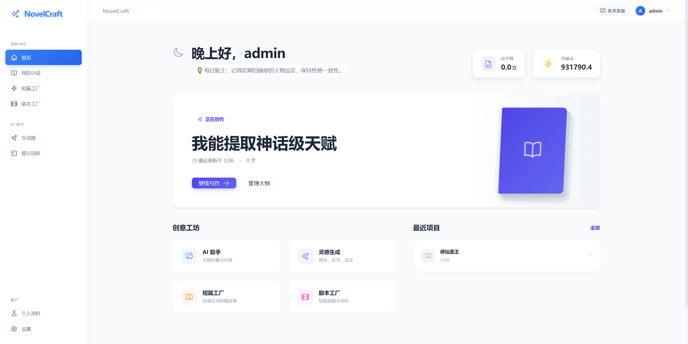
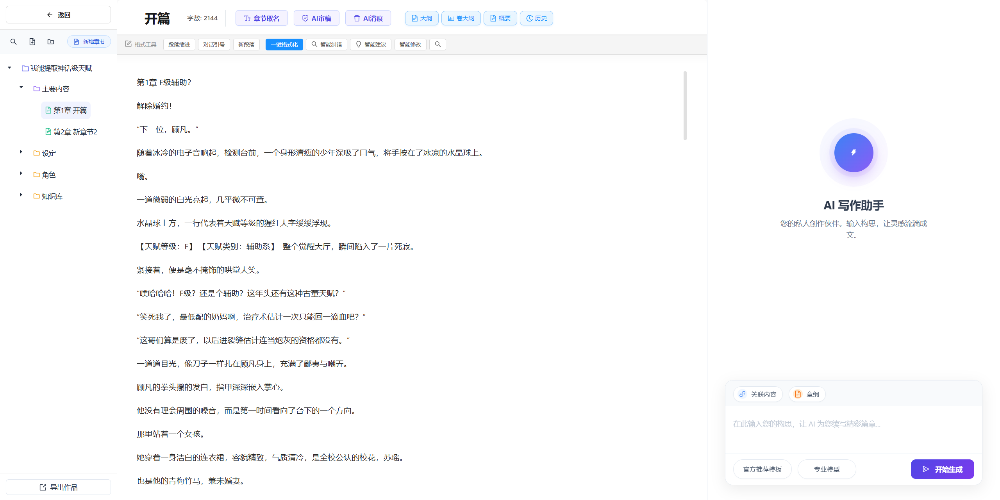
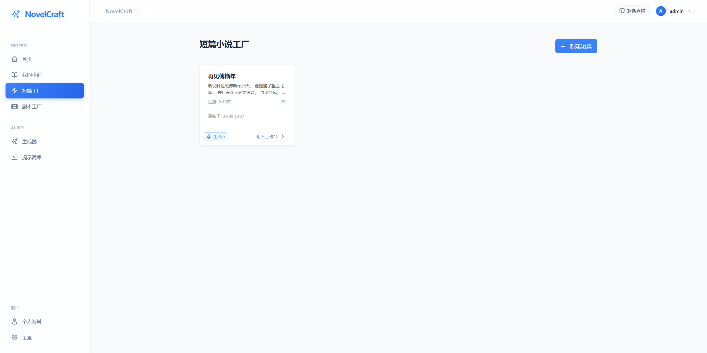
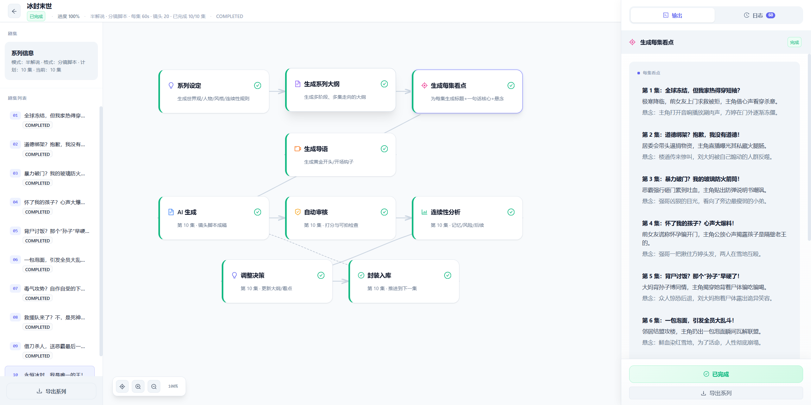
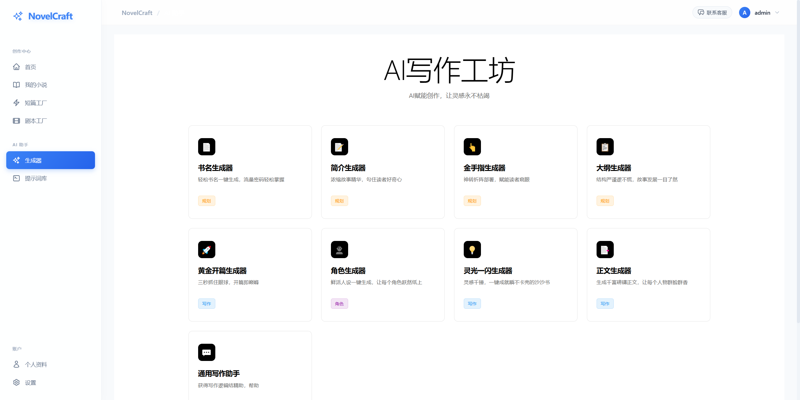

<p align="center">
  
</p>

<h1 align="center">📚 AI 智能网文创作系统</h1>

<p align="center">
  <strong>多模型大语言模型（LLM）驱动的 AI 小说 / 网文创作平台：从世界观与角色设定、大纲与分卷，到章节生成、润色与去 AI 味（消痕）的一体化工作流</strong>
</p>

<p align="center">
  <strong>微信：soe303（交流 / 反馈 / 合作）</strong>
</p>

<p align="center">
  <a href="https://novel.cutb.cn/">
    
  </a>
</p>

<p align="center">
  
  
  
  
  
  
  
  
</p>

<p align="center">
  
  
  
  
</p>

<p align="center">
  <a href="#-核心特性">核心特性</a> •
  <a href="#-系统架构">系统架构</a> •
  <a href="#-快速开始">快速开始</a> •
  <a href="#-功能演示">功能演示</a> •
  <a href="#-技术栈">技术栈</a> •
  <a href="#-部署指南">部署指南</a>
</p>

---

## 🎯 项目介绍

> **「让 AI 成为每一位网文作者的长期创作伙伴」**

这是一个面向**长篇小说 / 网文**的 AI 写作系统，围绕“可持续写长文”的核心难题做了工程化落地：
- **结构化创作**：世界观、角色卡、主线/支线、伏笔与回收、分卷与章节细纲。
- **长上下文写作**：按项目/卷/章管理上下文，尽量减少断片与设定漂移。
- **章节生成与改写**：流式生成（SSE）、多轮迭代、指令式重写。
- **润色与去 AI 味（消痕）**：降低模板化与“机械味”，更接近网文表达。
- **多模型接入**：DeepSeek / 通义千问 / Kimi / OpenAI Compatible 等，支持按任务切换与成本控制。


### 🏆 为什么选择我们？

| 痛点 | 传统方案 | 本系统方案 |
|------|---------|-----------|
| **大纲混乱** | 手动整理，容易遗漏 | AI 自动生成结构化超级大纲，包含伏笔、角色弧线 |
| **章节断裂** | 上下文记忆有限 | 智能上下文管理，支持 262K 超长记忆（Kimi） |
| **AI 味重** | 输出直接使用 | 专业「消痕」算法，去除 AI 生成痕迹 |
| **多模型切换** | 每次重新配置 | 前端一键切换，配置持久化 |
| **进度失控** | 无法追踪 | 实时进度监控，字数统计，任务队列 |
| **API 安全** | Key 暴露风险 | Key 仅存浏览器本地，永不上传服务器 |

---

## ✨ 核心特性

### 📝 智能创作引擎

<table>
<tr>
<td width="50%">

#### 🧠 AI 大纲生成
- **超级大纲**：一键生成 10 万字级别的完整小说框架
- **结构化输出**：主线剧情 / 支线剧情 / 角色发展 / 伏笔设计
- **卷级规划**：自动拆分为多卷，每卷独立主题
- **章节细纲**：精确到每一章的情节点和字数规划

</td>
<td width="50%">

#### ✍️ 流式写作
- **SSE 实时流**：边生成边显示，所见即所得
- **上下文感知**：自动关联前文，保持剧情连贯
- **多轮对话**：支持追问和修改指令
- **自动保存**：断点续写，永不丢失

</td>
</tr>
<tr>
<td width="50%">

#### 🎨 AI 消痕系统
- **深度去 AI 化**：消除机器生成的刻板表达
- **文风保持**：保留作者个人风格
- **流式处理**：实时查看消痕效果
- **对比预览**：原文 vs 消痕后对比

</td>
<td width="50%">

#### 📊 创作管理
- **项目仪表盘**：所有小说一览无余
- **进度追踪**：字数统计、完成度、日更目标
- **任务队列**：后台异步处理，不阻塞操作
- **版本历史**：随时回溯修改记录

</td>
</tr>
</table>

### 🤖 多模型智能调度

```
┌─────────────────────────────────────────────────────────────────┐
│                      AI 模型调度中心                              │
├─────────────────────────────────────────────────────────────────┤
│                                                                 │
│   ┌─────────────┐   ┌─────────────┐   ┌─────────────┐          │
│   │  DeepSeek   │   │  通义千问    │   │    Kimi     │          │
│   │  128K 上下文 │   │  32K-128K   │   │  262K 上下文 │          │
│   │  高性价比    │   │  平衡之选    │   │  超长记忆    │          │
│   └──────┬──────┘   └──────┬──────┘   └──────┬──────┘          │
│          │                 │                 │                  │
│          └────────────────┼────────────────┘                  │
│                           ▼                                     │
│              ┌─────────────────────────┐                       │
│              │   智能路由 & 负载均衡    │                       │
│              │   • 自动故障转移        │                       │
│              │   • 成本优化策略        │                       │
│              │   • 响应质量评估        │                       │
│              └─────────────────────────┘                       │
│                                                                 │
└─────────────────────────────────────────────────────────────────┘
```

| 模型 | 推荐用途 | 上下文 | 特点 |
|------|---------|--------|------|
| `deepseek-chat` | 日常写作、大纲生成 | 128K | 性价比之王，质量稳定 |
| `deepseek-reasoner` | 复杂剧情推理 | 128K | 深度思考，逻辑严密 |
| `qwen-plus` | 通用创作 | 32K | 响应快，平衡之选 |
| `qwen-max` | 高质量输出 | 32K | 阿里旗舰，效果优秀 |
| `moonshot-v1-128k` | 长篇连贯写作 | 128K | 上下文超长 |
| `moonshot-v1-32k` | 常规写作 | 32K | Kimi 基础版 |

---

## 🏗️ 系统架构

```
                                    ┌──────────────────────────────────────┐
                                    │            客户端层                   │
                                    │  ┌────────────────────────────────┐  │
                                    │  │     React 18 + TypeScript 5    │  │
                                    │  │  ┌──────┐ ┌──────┐ ┌────────┐  │  │
                                    │  │  │Redux │ │Axios │ │AntDesign│ │  │
                                    │  │  │Toolkit│ │ SSE │ │   5.x  │  │  │
                                    │  │  └──────┘ └──────┘ └────────┘  │  │
                                    │  └────────────────────────────────┘  │
                                    └──────────────────┬───────────────────┘
                                                       │ HTTPS / WebSocket
                                                       ▼
┌──────────────────────────────────────────────────────────────────────────────────────┐
│                                    网关层 (Nginx)                                      │
│                    负载均衡 • SSL 终结 • 静态资源 • 反向代理                             │
└──────────────────────────────────────────────────────┬───────────────────────────────┘
                                                       │
                                                       ▼
┌──────────────────────────────────────────────────────────────────────────────────────┐
│                                   应用服务层                                           │
│  ┌─────────────────────────────────────────────────────────────────────────────────┐ │
│  │                         Spring Boot 2.7.18 Application                          │ │
│  │                                                                                  │ │
│  │  ┌─────────────┐  ┌─────────────┐  ┌─────────────┐  ┌─────────────┐            │ │
│  │  │ AuthModule  │  │ NovelModule │  │  AIModule   │  │ TaskModule  │            │ │
│  │  │ • JWT 认证   │  │ • 小说管理  │  │ • 模型调度  │  │ • 异步任务  │            │ │
│  │  │ • 权限控制   │  │ • 大纲生成  │  │ • 流式输出  │  │ • 进度追踪  │            │ │
│  │  │ • 会话管理   │  │ • 卷章管理  │  │ • 消痕处理  │  │ • 队列管理  │            │ │
│  │  └─────────────┘  └─────────────┘  └─────────────┘  └─────────────┘            │ │
│  │                                                                                  │ │
│  │  ┌───────────────────────────────────────────────────────────────────────────┐  │ │
│  │  │                           核心服务层                                        │  │ │
│  │  │  AIWritingService • OutlineService • VolumeService • ChapterService       │  │ │
│  │  │  TraceRemovalService • PolishService • TaskScheduler • CacheManager       │  │ │
│  │  └───────────────────────────────────────────────────────────────────────────┘  │ │
│  │                                                                                  │ │
│  │  ┌───────────────────────────────────────────────────────────────────────────┐  │ │
│  │  │                           数据访问层 (MyBatis Plus)                         │  │ │
│  │  │  NovelMapper • ChapterMapper • VolumeMapper • TaskMapper • UserMapper      │  │ │
│  │  └───────────────────────────────────────────────────────────────────────────┘  │ │
│  └─────────────────────────────────────────────────────────────────────────────────┘ │
└──────────────────────────────────────────────────────┬───────────────────────────────┘
                                                       │
                          ┌────────────────────────────┼────────────────────────────┐
                          │                            │                            │
                          ▼                            ▼                            ▼
              ┌───────────────────┐      ┌───────────────────┐      ┌───────────────────┐
              │   MySQL 8.0       │      │   Redis 7.x       │      │   AI Provider     │
              │   • 业务数据       │      │   • 会话缓存       │      │   • DeepSeek      │
              │   • 小说内容       │      │   • 任务队列       │      │   • 通义千问       │
              │   • 用户信息       │      │   • 分布式锁       │      │   • Kimi          │
              └───────────────────┘      └───────────────────┘      └───────────────────┘
```

### 🔧 核心模块说明

| 模块 | 职责 | 关键技术 |
|------|------|---------|
| **认证模块** | 用户注册登录、JWT 令牌管理、权限校验 | Spring Security, JWT, BCrypt |
| **小说模块** | 小说 CRUD、大纲管理、卷章结构 | MyBatis Plus, 分页插件 |
| **AI 模块** | 多模型调度、流式输出、消痕处理 | RestTemplate, SSE, WebClient |
| **任务模块** | 异步任务、进度追踪、失败重试 | @Async, CompletableFuture |
| **缓存模块** | 热点数据缓存、会话存储 | Redis, Lettuce |

---

## 🖼️ 项目截图（docs/img）

> 截图文件位于 `docs/img/`，提交到仓库后 GitHub 会直接展示。

<details>
<summary><b>📸 点击展开界面截图</b></summary>

<br>

### 🏠 首页 / 创作工作台



---

### ✍️ 写作页面



---

### 📌 其他页面







</details>

---

## 🛠️ 技术栈

### 后端技术矩阵

| 类别 | 技术 | 版本 | 说明 |
|------|------|------|------|
| **核心框架** | Spring Boot | 2.7.18 | 企业级应用框架 |
| **安全框架** | Spring Security | 5.7.x | 认证授权 |
| **持久层** | MyBatis Plus | 3.5.x | 增强型 ORM |
| **数据库** | MySQL | 8.0+ | 关系型数据库 |
| **缓存** | Redis | 7.x | 分布式缓存 |
| **连接池** | HikariCP | 4.x | 高性能连接池 |
| **API 文档** | SpringDoc | 1.6.x | OpenAPI 3.0 |
| **工具库** | Lombok | 1.18.x | 代码简化 |
| **JSON** | Jackson | 2.13.x | 序列化框架 |

### 前端技术矩阵

| 类别 | 技术 | 版本 | 说明 |
|------|------|------|------|
| **核心框架** | React | 18.2 | 声明式 UI 框架 |
| **开发语言** | TypeScript | 5.0 | 类型安全 |
| **UI 组件库** | Ant Design | 5.x | 企业级设计系统 |
| **状态管理** | Redux Toolkit | 1.9.x | 状态容器 |
| **路由** | React Router | 6.x | 声明式路由 |
| **HTTP 客户端** | Axios | 1.4.x | Promise HTTP |
| **构建工具** | Vite | 4.x | 极速构建 |
| **代码规范** | ESLint + Prettier | - | 代码质量 |

### DevOps & 基础设施

| 类别 | 技术 | 说明 |
|------|------|------|
| **容器化** | Docker | 应用容器化 |
| **编排** | Docker Compose | 多容器编排 |
| **反向代理** | Nginx | 负载均衡 & 静态资源 |
| **版本控制** | Git | 代码版本管理 |
| **CI/CD** | GitHub Actions | 自动化部署（可选） |

---

## 🚀 快速开始

### 📋 环境要求

| 依赖 | 最低版本 | 推荐版本 |
|------|---------|---------|
| JDK | 17 | 17 LTS |
| Node.js | 16 | 18 LTS |
| MySQL | 5.7 | 8.0 |
| Redis | 6.0 | 7.x |
| Maven | 3.6 | 3.9 |

### ⚡ 一键部署（Docker）

```bash
# 克隆项目
git clone https://github.com/your-username/novel-creation-system.git
cd novel-creation-system

# 使用 Docker Compose 一键启动
docker-compose up -d

# 访问系统
# 前端：http://localhost:8701
# 后端：http://localhost:8080/api
```

### 🔧 手动部署

<details>
<summary><b>点击展开详细步骤</b></summary>

#### 1️⃣ 数据库初始化

```bash
# 登录 MySQL
mysql -u root -p

# 创建数据库
CREATE DATABASE ai_novel CHARACTER SET utf8mb4 COLLATE utf8mb4_unicode_ci;

# 退出后导入数据
mysql -u root -p ai_novel < database/ai_novel.sql

# （可选）创建管理员账号
mysql -u root -p ai_novel < database/init_admin.sql
```

#### 2️⃣ 后端配置

编辑 `backend/src/main/resources/application-dev.yml`：

```yaml
spring:
  datasource:
    url: jdbc:mysql://localhost:3306/ai_novel?useSSL=false&serverTimezone=Asia/Shanghai
    username: your_username
    password: your_password
  redis:
    host: localhost
    port: 6379

jwt:
  secret: your-jwt-secret-key-at-least-32-characters
```

或使用环境变量：

```bash
export DB_HOST=localhost
export DB_USERNAME=root
export DB_PASSWORD=your_password
export REDIS_HOST=localhost
export JWT_SECRET=your-jwt-secret-key
```

#### 3️⃣ 启动后端

```bash
cd backend
mvn clean package -DskipTests
java -jar target/novel-creation-system-1.0.0.jar --spring.profiles.active=dev

# 或开发模式
mvn spring-boot:run -Dspring-boot.run.profiles=dev
```

#### 4️⃣ 启动前端

```bash
cd frontend
npm install
npm run dev
```

#### 5️⃣ 访问系统

- 前端：http://localhost:3000
- 后端 API：http://localhost:8080/api
- API 文档：http://localhost:8080/api/swagger-ui.html

</details>

---

## ⚙️ 配置说明

### 环境变量一览

| 变量名 | 说明 | 默认值 | 必填 |
|--------|------|--------|------|
| `DB_HOST` | 数据库主机 | `localhost` | 否 |
| `DB_PORT` | 数据库端口 | `3306` | 否 |
| `DB_NAME` | 数据库名称 | `ai_novel` | 否 |
| `DB_USERNAME` | 数据库用户名 | `root` | 是 |
| `DB_PASSWORD` | 数据库密码 | - | 是 |
| `REDIS_HOST` | Redis 主机 | `localhost` | 否 |
| `REDIS_PORT` | Redis 端口 | `6379` | 否 |
| `REDIS_PASSWORD` | Redis 密码 | - | 否 |
| `JWT_SECRET` | JWT 签名密钥 | - | 是（生产环境） |
| `JWT_EXPIRATION` | JWT 过期时间(ms) | `604800000` | 否 |

### AI 配置（浏览器端）

系统采用**前端配置**策略，API Key 安全存储于浏览器 `localStorage`，永不上传服务器：

1. 登录系统后，进入 **设置** 页面
2. 选择 AI 服务商：DeepSeek / 通义千问 / Kimi / 自定义
3. 填入 API Key 和 Base URL
4. 选择模型并保存

> 🔒 **安全提示**：所有 AI 调用均在后端进行，前端仅传递加密配置，API Key 不会出现在网络请求中。

---

## 📁 项目结构

```
novel-creation-system/
│
├── backend/                          # 🔧 后端服务 (Spring Boot)
│   ├── src/main/java/com/novel/
│   │   ├── config/                   # 配置类
│   │   │   ├── SecurityConfig.java   # 安全配置
│   │   │   ├── CorsConfig.java       # 跨域配置
│   │   │   └── RedisConfig.java      # Redis 配置
│   │   ├── controller/               # 控制器层
│   │   │   ├── AuthController.java   # 认证接口
│   │   │   ├── NovelController.java  # 小说接口
│   │   │   ├── AIController.java     # AI 接口
│   │   │   └── ChapterController.java# 章节接口
│   │   ├── service/                  # 服务层
│   │   │   ├── AIWritingService.java # AI 写作服务
│   │   │   ├── OutlineService.java   # 大纲服务
│   │   │   └── TraceRemovalService.java # 消痕服务
│   │   ├── domain/                   # 实体类
│   │   ├── mapper/                   # MyBatis Mapper
│   │   └── dto/                      # 数据传输对象
│   ├── src/main/resources/
│   │   ├── application.yml           # 主配置
│   │   ├── application-dev.yml       # 开发环境
│   │   ├── application-prod.yml      # 生产环境
│   │   └── mapper/                   # XML 映射文件
│   └── pom.xml                       # Maven 配置
│
├── frontend/                         # 🎨 前端应用 (React)
│   ├── src/
│   │   ├── pages/                    # 页面组件
│   │   │   ├── HomePage.tsx          # 首页
│   │   │   ├── WritingPage.tsx       # 写作页
│   │   │   └── SettingsPage.tsx      # 设置页
│   │   ├── components/               # 通用组件
│   │   ├── services/                 # API 服务
│   │   ├── store/                    # Redux Store
│   │   ├── hooks/                    # 自定义 Hooks
│   │   ├── utils/                    # 工具函数
│   │   └── types/                    # TypeScript 类型
│   ├── package.json
│   └── vite.config.ts
│
├── database/                         # 📊 数据库脚本
│   ├── ai_novel.sql                  # 完整建表脚本
│   └── init_admin.sql                # 管理员初始化
│
├── docker-compose.yml                # 🐳 Docker 编排
├── nginx.conf                        # 🌐 Nginx 配置
└── README.md                         # 📖 项目文档
```

---

## 🐳 Docker 部署

### docker-compose.yml 配置

```yaml
version: '3.8'
services:
  backend:
    image: novel-backend:latest
    ports:
      - "8080:8080"
    environment:
      - SPRING_PROFILES_ACTIVE=docker
      - DB_HOST=mysql
      - REDIS_HOST=redis
    depends_on:
      - mysql
      - redis

  frontend:
    image: novel-frontend:latest
    ports:
      - "8701:80"
    depends_on:
      - backend

  mysql:
    image: mysql:8.0
    environment:
      MYSQL_ROOT_PASSWORD: root
      MYSQL_DATABASE: ai_novel
    volumes:
      - mysql_data:/var/lib/mysql

  redis:
    image: redis:7-alpine
    volumes:
      - redis_data:/data

volumes:
  mysql_data:
  redis_data:
```

### 构建与部署

```bash
# 构建镜像
docker-compose build

# 启动服务
docker-compose up -d

# 查看日志
docker-compose logs -f

# 停止服务
docker-compose down
```

---

## 📮 联系方式

<table>
<tr>
<td align="center">
  
  <br>
  <sub>技术交流 & 问题咨询</sub>
</td>
<td align="center">
  <a href="https://github.com/your-username/novel-creation-system/issues">
    
  </a>
  <br>
  <sub>Bug 反馈 & 功能建议</sub>
</td>
</tr>
</table>

---

## 📄 开源协议

本项目采用 **个人使用许可证**（Personal Use License）

| 许可 | 说明 |
|------|------|
| ✅ 允许 | 个人学习、研究、非商业使用 |
| ❌ 禁止 | 商业用途、二次分发、售卖盈利 |

详见 [LICENSE](./LICENSE) 文件

---

## 🙏 鸣谢

感谢以下开源项目和服务的支持：

<p align="center">
  <a href="https://spring.io/projects/spring-boot"></a>
  <a href="https://react.dev/"></a>
  <a href="https://ant.design/"></a>
  <a href="https://www.typescriptlang.org/"></a>
  <a href="https://vitejs.dev/"></a>
</p>

<p align="center">
  <a href="https://www.deepseek.com/"></a>
  <a href="https://tongyi.aliyun.com/"></a>
  <a href="https://www.moonshot.cn/"></a>
</p>

---

<div align="center">

## ⭐ 觉得有用？给个 Star 支持一下！

**您的 Star 是我持续更新的动力 💪**

<br>


<br>
<br>

**Made with ❤️ by 网文创作爱好者**

</div>
