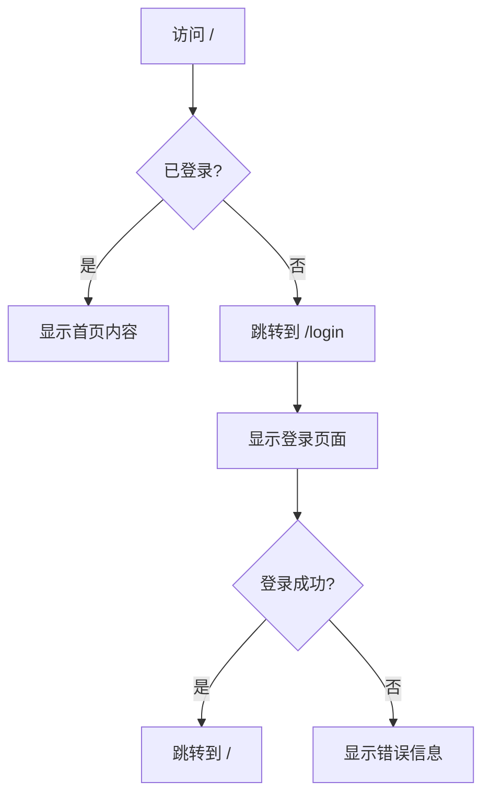

# 认证流程开发指南

## 快速导航
- [文件结构](#文件结构)
- [认证流程](#认证流程)
- [路由配置](#路由配置)
- [状态管理](#状态管理)
- [样式自定义](#样式自定义)

## 文件结构

```
frontend/src/
├── App.tsx                          # 主应用，包含路由配置
├── pages/
│   ├── LoginPage.tsx               # 登录页面
│   ├── LoginPage.css               # 登录页面样式
│   ├── RegisterPage.tsx            # 注册页面
│   ├── RegisterPage.css            # 注册页面样式
│   └── HomePage.new.tsx            # 首页（带认证检查）
├── store/
│   ├── index.ts                    # Redux store配置
│   └── slices/
│       └── authSlice.ts            # 认证状态管理
└── services/
    └── authService.ts              # 认证API服务
```

## 认证流程

### 1. 用户访问流程



### 2. 登录流程代码实现

```typescript
// LoginPage.tsx
const onFinish = async (values: LoginForm) => {
  try {
    // 调用 Redux action
    await dispatch(login({
      usernameOrEmail: values.usernameOrEmail,
      password: values.password,
    })).unwrap()
    
    // 显示成功消息
    message.success('登录成功！')
    
    // 跳转到首页
    navigate('/')
  } catch (error) {
    // 错误由 authSlice 处理
  }
}
```

### 3. 注册流程代码实现

```typescript
// RegisterPage.tsx
const onFinish = async (values: RegisterForm) => {
  try {
    // 调用 Redux action
    await dispatch(register({
      username: values.username,
      email: values.email,
      password: values.password,
    })).unwrap()
    
    // 显示成功消息
    message.success('注册成功！')
    
    // 跳转到首页（自动登录）
    navigate('/')
  } catch (error) {
    // 错误由 authSlice 处理
  }
}
```

### 4. 首页认证检查

```typescript
// HomePage.new.tsx
useEffect(() => {
  if (!isAuthenticated) {
    navigate('/login')
  }
}, [isAuthenticated, navigate])
```

## 路由配置

### App.tsx 路由结构

```typescript
const App: React.FC = () => {
  const location = useLocation()
  
  // 判断当前页面类型
  const isWritingPage = location.pathname.includes('/writing')
  const isAuthPage = location.pathname === '/login' || 
                     location.pathname === '/register'
  
  return (
    <AntdApp>
      {isWritingPage ? (
        // 写作页面：全屏，无导航
        <Layout>...</Layout>
      ) : isAuthPage ? (
        // 认证页面：全屏，无导航
        <Layout>
          <Routes>
            <Route path="/login" element={<LoginPage />} />
            <Route path="/register" element={<RegisterPage />} />
          </Routes>
        </Layout>
      ) : (
        // 普通页面：带导航栏和侧边栏
        <Layout>
          <AppHeader />
          <AppSider />
          <Content>
            <Routes>
              <Route path="/" element={<HomePage />} />
              {/* 其他路由... */}
            </Routes>
          </Content>
        </Layout>
      )}
    </AntdApp>
  )
}
```

### 路由保护示例

如果需要保护其他路由，可以创建一个 `ProtectedRoute` 组件：

```typescript
// components/ProtectedRoute.tsx
interface ProtectedRouteProps {
  children: React.ReactNode
}

const ProtectedRoute: React.FC<ProtectedRouteProps> = ({ children }) => {
  const { isAuthenticated } = useSelector((state: RootState) => state.auth)
  const navigate = useNavigate()
  
  useEffect(() => {
    if (!isAuthenticated) {
      navigate('/login')
    }
  }, [isAuthenticated, navigate])
  
  return isAuthenticated ? <>{children}</> : null
}

// 使用示例
<Route 
  path="/protected" 
  element={
    <ProtectedRoute>
      <ProtectedPage />
    </ProtectedRoute>
  } 
/>
```

## 状态管理

### AuthSlice 结构

```typescript
interface AuthState {
  user: User | null           // 当前用户信息
  token: string | null        // JWT token
  isAuthenticated: boolean    // 认证状态
  loading: boolean            // 加载状态
  error: string | null        // 错误信息
}
```

### 关键 Actions

#### 1. login
```typescript
// 使用
dispatch(login({ 
  usernameOrEmail: 'user@example.com', 
  password: 'password123' 
}))

// 成功后自动更新：
// - state.user
// - state.token
// - state.isAuthenticated = true
// - localStorage.setItem('token', token)
```

#### 2. register
```typescript
// 使用
dispatch(register({ 
  username: 'newuser', 
  email: 'user@example.com',
  password: 'password123' 
}))

// 成功后自动登录并更新状态
```

#### 3. logout
```typescript
// 使用
dispatch(logout())

// 清除所有认证信息：
// - state.user = null
// - state.token = null
// - state.isAuthenticated = false
// - localStorage.removeItem('token')
```

#### 4. getProfile
```typescript
// 使用（刷新用户信息）
dispatch(getProfile())

// 成功后更新 state.user
// 失败时清除认证状态
```

### 在组件中使用

```typescript
// 读取认证状态
const { isAuthenticated, user, loading, error } = useSelector(
  (state: RootState) => state.auth
)

// 调用认证 actions
const dispatch = useDispatch<AppDispatch>()

// 登录
dispatch(login({ usernameOrEmail, password }))

// 注册
dispatch(register({ username, email, password }))

// 登出
dispatch(logout())

// 清除错误
dispatch(clearError())
```

## 样式自定义

### 修改颜色主题

在 `LoginPage.css` 和 `RegisterPage.css` 中修改：

```css
/* 主渐变色 */
.login-page {
  background: linear-gradient(135deg, #667eea 0%, #764ba2 100%);
  /* 改为其他颜色：
  background: linear-gradient(135deg, #12c2e9 0%, #c471ed 100%);
  */
}

/* Logo和按钮渐变 */
.logo-icon,
.login-button {
  background: linear-gradient(135deg, #667eea 0%, #764ba2 100%);
  /* 保持与页面背景一致 */
}

/* Focus边框颜色 */
.login-form .ant-input:focus {
  border-color: #667eea;
  /* 改为主题色 */
}
```

### 修改动画效果

```css
/* 调整动画速度 */
.logo-icon {
  animation: pulse 2s infinite;
  /* 改为 4s 使动画更慢 */
}

.decoration-circle {
  animation: float 20s infinite ease-in-out;
  /* 改为 10s 使动画更快 */
}

/* 禁用某个动画 */
.logo-icon {
  animation: none;
}
```

### 自定义卡片样式

```css
.login-card {
  border-radius: 20px;           /* 圆角大小 */
  padding: 48px 40px;            /* 内边距 */
  max-width: 420px;              /* 最大宽度 */
  background: rgba(255, 255, 255, 0.95);  /* 透明度 */
  backdrop-filter: blur(10px);   /* 毛玻璃效果强度 */
}
```

## API 集成

### authService.ts 结构

```typescript
export const authService = {
  // 登录
  login: async (credentials: { usernameOrEmail: string; password: string }) => {
    const response = await api.post('/api/auth/login', credentials)
    return response.data
  },
  
  // 注册
  register: async (userData: { username: string; email: string; password: string }) => {
    const response = await api.post('/api/auth/register', userData)
    return response.data
  },
  
  // 获取用户信息
  getProfile: async () => {
    const response = await api.get('/api/user/profile')
    return response.data
  },
  
  // 登出
  logout: async () => {
    await api.post('/api/auth/logout')
  }
}
```

### API 响应格式

期望的后端响应格式：

```json
// 登录/注册成功响应
{
  "code": 200,
  "message": "成功",
  "data": {
    "user": {
      "id": 1,
      "username": "testuser",
      "email": "test@example.com",
      "nickname": "测试用户",
      "avatarUrl": "https://...",
      "status": "ACTIVE",
      "createdAt": "2025-10-20T00:00:00Z",
      "updatedAt": "2025-10-20T00:00:00Z"
    },
    "token": "eyJhbGciOiJIUzI1NiIs..."
  }
}

// 错误响应
{
  "code": 400,
  "message": "用户名或密码错误",
  "data": null
}
```

## 表单验证

### LoginPage 验证规则

```typescript
<Form.Item
  name="usernameOrEmail"
  rules={[
    { required: true, message: '请输入用户名或邮箱' },
  ]}
>
  <Input ... />
</Form.Item>

<Form.Item
  name="password"
  rules={[
    { required: true, message: '请输入密码' },
    { min: 6, message: '密码长度不能少于6位' },
  ]}
>
  <Input.Password ... />
</Form.Item>
```

### RegisterPage 验证规则

```typescript
<Form.Item
  name="username"
  rules={[
    { required: true, message: '请输入用户名' },
    { min: 3, message: '用户名长度不能少于3位' },
    { max: 20, message: '用户名长度不能超过20位' },
    { pattern: /^[a-zA-Z0-9_]+$/, message: '用户名只能包含字母、数字和下划线' },
  ]}
>
  <Input ... />
</Form.Item>

<Form.Item
  name="email"
  rules={[
    { required: true, message: '请输入邮箱' },
    { type: 'email', message: '请输入有效的邮箱地址' },
  ]}
>
  <Input ... />
</Form.Item>

<Form.Item
  name="confirmPassword"
  dependencies={['password']}
  rules={[
    { required: true, message: '请确认密码' },
    ({ getFieldValue }) => ({
      validator(_, value) {
        if (!value || getFieldValue('password') === value) {
          return Promise.resolve()
        }
        return Promise.reject(new Error('两次输入的密码不一致'))
      },
    }),
  ]}
>
  <Input.Password ... />
</Form.Item>
```

### 自定义验证规则

```typescript
// 添加自定义验证器
const validatePassword = (_: any, value: string) => {
  if (!value) {
    return Promise.reject(new Error('请输入密码'))
  }
  
  if (value.length < 6) {
    return Promise.reject(new Error('密码长度不能少于6位'))
  }
  
  if (!/[A-Z]/.test(value)) {
    return Promise.reject(new Error('密码必须包含大写字母'))
  }
  
  if (!/[0-9]/.test(value)) {
    return Promise.reject(new Error('密码必须包含数字'))
  }
  
  return Promise.resolve()
}

// 使用
<Form.Item
  name="password"
  rules={[{ validator: validatePassword }]}
>
  <Input.Password ... />
</Form.Item>
```

## 错误处理

### 全局错误处理

```typescript
// authSlice.ts
.addCase(login.rejected, (state, action) => {
  state.loading = false
  state.error = action.error.message || '登录失败'
})
```

### 组件内错误处理

```typescript
// LoginPage.tsx
useEffect(() => {
  if (error) {
    message.error(error)      // 显示错误消息
    dispatch(clearError())    // 清除错误状态
  }
}, [error, dispatch])
```

### 自定义错误处理

```typescript
const onFinish = async (values: LoginForm) => {
  try {
    await dispatch(login(values)).unwrap()
    message.success('登录成功！')
    navigate('/')
  } catch (error: any) {
    // 自定义错误处理
    if (error.code === 'INVALID_CREDENTIALS') {
      message.error('用户名或密码错误')
    } else if (error.code === 'ACCOUNT_LOCKED') {
      message.error('账户已被锁定，请联系管理员')
    } else {
      message.error('登录失败，请稍后重试')
    }
  }
}
```

## 本地存储

### Token 存储

```typescript
// 保存 token
localStorage.setItem('token', token)

// 读取 token
const token = localStorage.getItem('token')

// 删除 token
localStorage.removeItem('token')
```

### 完整示例

```typescript
// authSlice.ts - login.fulfilled
.addCase(login.fulfilled, (state, action) => {
  state.loading = false
  const response = action.payload.data || action.payload
  
  state.user = response.user
  state.token = response.token
  state.isAuthenticated = true
  
  // 保存到 localStorage
  localStorage.setItem('token', response.token)
})

// App.tsx - 初始化时从 localStorage 恢复
const initialState: AuthState = {
  user: null,
  token: localStorage.getItem('token'),
  isAuthenticated: !!localStorage.getItem('token'),
  loading: false,
  error: null,
}
```

## 常见问题

### Q1: 如何实现"记住我"功能？

A: "记住我"功能已在登录页面实现，默认勾选。token 会保存在 localStorage，直到用户主动登出。

如果需要更精细的控制：

```typescript
const onFinish = async (values: LoginForm) => {
  try {
    await dispatch(login({
      usernameOrEmail: values.usernameOrEmail,
      password: values.password,
    })).unwrap()
    
    if (values.rememberMe) {
      // 保存到 localStorage（长期）
      localStorage.setItem('token', token)
    } else {
      // 保存到 sessionStorage（关闭浏览器后失效）
      sessionStorage.setItem('token', token)
    }
    
    navigate('/')
  } catch (error) {
    // ...
  }
}
```

### Q2: 如何添加第三方登录？

A: 在登录页面的"或"分隔符下方添加第三方登录按钮：

```typescript
<div className="login-divider">
  <span>或</span>
</div>

<div className="third-party-login">
  <Button 
    icon={<GoogleOutlined />}
    onClick={handleGoogleLogin}
    block
  >
    使用 Google 登录
  </Button>
  
  <Button 
    icon={<GithubOutlined />}
    onClick={handleGithubLogin}
    block
    style={{ marginTop: 12 }}
  >
    使用 GitHub 登录
  </Button>
</div>
```

### Q3: 如何实现"忘记密码"功能？

A: 目前"忘记密码"链接已预留，需要实现功能：

```typescript
// 1. 创建 ForgotPasswordPage.tsx
// 2. 添加路由
<Route path="/forgot-password" element={<ForgotPasswordPage />} />

// 3. 修改登录页面链接
<Link to="/forgot-password" className="forgot-link">
  忘记密码？
</Link>

// 4. 实现重置密码流程
// - 输入邮箱
// - 发送验证码
// - 验证码验证
// - 设置新密码
```

### Q4: 如何自动刷新 token？

A: 可以使用 axios interceptor：

```typescript
// services/api.ts
api.interceptors.response.use(
  response => response,
  async error => {
    const originalRequest = error.config
    
    if (error.response?.status === 401 && !originalRequest._retry) {
      originalRequest._retry = true
      
      try {
        // 刷新 token
        const response = await api.post('/api/auth/refresh-token')
        const newToken = response.data.token
        
        // 更新 token
        localStorage.setItem('token', newToken)
        originalRequest.headers.Authorization = `Bearer ${newToken}`
        
        // 重试原请求
        return api(originalRequest)
      } catch (refreshError) {
        // 刷新失败，跳转到登录页
        store.dispatch(clearAuth())
        window.location.href = '/login'
        return Promise.reject(refreshError)
      }
    }
    
    return Promise.reject(error)
  }
)
```

## 测试指南

### 单元测试示例

```typescript
// LoginPage.test.tsx
import { render, screen, fireEvent, waitFor } from '@testing-library/react'
import { Provider } from 'react-redux'
import { BrowserRouter } from 'react-router-dom'
import LoginPage from './LoginPage'
import { store } from '@/store'

describe('LoginPage', () => {
  it('should render login form', () => {
    render(
      <Provider store={store}>
        <BrowserRouter>
          <LoginPage />
        </BrowserRouter>
      </Provider>
    )
    
    expect(screen.getByPlaceholderText('用户名或邮箱')).toBeInTheDocument()
    expect(screen.getByPlaceholderText('密码')).toBeInTheDocument()
    expect(screen.getByText('登录')).toBeInTheDocument()
  })
  
  it('should show validation errors', async () => {
    render(
      <Provider store={store}>
        <BrowserRouter>
          <LoginPage />
        </BrowserRouter>
      </Provider>
    )
    
    const loginButton = screen.getByText('登录')
    fireEvent.click(loginButton)
    
    await waitFor(() => {
      expect(screen.getByText('请输入用户名或邮箱')).toBeInTheDocument()
      expect(screen.getByText('请输入密码')).toBeInTheDocument()
    })
  })
})
```

## 性能优化建议

### 1. 懒加载认证页面

```typescript
// App.tsx
const LoginPage = lazy(() => import('@/pages/LoginPage'))
const RegisterPage = lazy(() => import('@/pages/RegisterPage'))

// 使用 Suspense
<Suspense fallback={<Loading />}>
  <Routes>
    <Route path="/login" element={<LoginPage />} />
    <Route path="/register" element={<RegisterPage />} />
  </Routes>
</Suspense>
```

### 2. 优化动画性能

```css
/* 使用 will-change 提示浏览器优化 */
.logo-icon {
  will-change: transform;
}

.decoration-circle {
  will-change: transform, opacity;
}
```

### 3. 减少重渲染

```typescript
// 使用 useMemo 缓存计算结果
const isAuthPage = useMemo(
  () => location.pathname === '/login' || location.pathname === '/register',
  [location.pathname]
)

// 使用 useCallback 缓存函数
const handleLogin = useCallback(async (values: LoginForm) => {
  // ...
}, [dispatch, navigate])
```

---

**最后更新**: 2025-10-20
**文档版本**: v1.0


